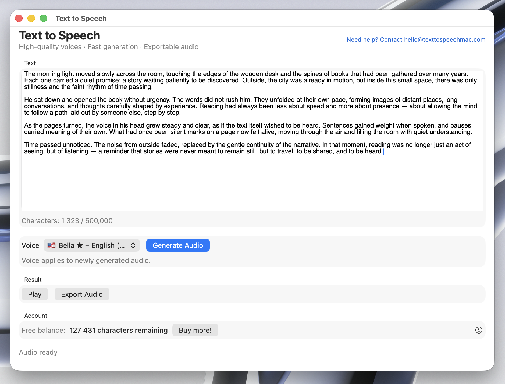

## TextToSpeechMac
### Simple Text-to-Speech for macOS

**TextToSpeechMac** is a native macOS app that converts written text into spoken audio.

Paste text, generate speech, and export audio files directly on your Mac.

No unnecessary features. Just text to speech.

  

---

## What It Does

TextToSpeechMac turns text into audio you can listen to or export.

- Paste or type text
- Generate spoken audio
- Use it for listening, proofreading, or accessibility
- Designed specifically for macOS

---

## Core Features

- Text-to-speech conversion on macOS
- Simple, native macOS interface
- Paste or type any text
- Generate audio from text
- Export generated speech for later use
- No account required

---

## Common Use Cases

- Listening to long articles or documents
- Proofreading written text
- Accessibility and reading support
- Creating spoken versions of notes or scripts
- Offline or distraction-free listening workflows

---

## Designed for macOS

TextToSpeechMac is built as a native macOS app, not a web wrapper.

- Fast startup
- Keyboard-friendly
- Works naturally with macOS workflows

---

## Download

**Download TextToSpeechMac for macOS**

👉 **Download for macOS**

No signup required.  
Download and run.

---

## Roadmap

Planned features (not guaranteed):

- More voice options
- Audio format improvements
- Performance optimizations

---

## Contact

Questions, feedback, or bug reports:

**matyashajek@proton.me**
