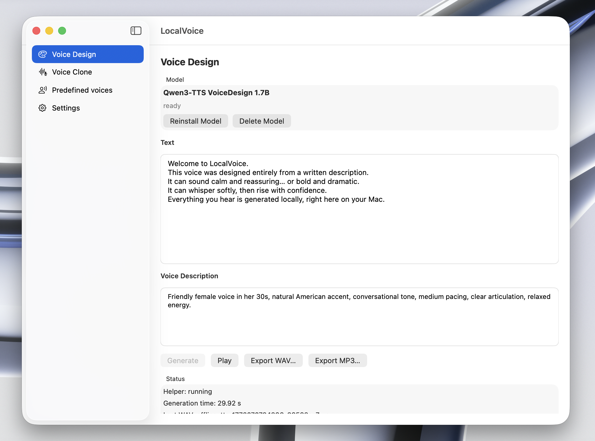

# LocalVoice – Offline AI Text to Speech for Mac

LocalVoice is a powerful offline AI voice engine that runs entirely on your Mac.  
No cloud. No subscriptions. No data leaving your device.

Generate natural, expressive speech from text with advanced voice control and rapid voice cloning — fully local.

---

## 🚀 Features

### 🎙 Voice Cloning
Generate speech in the style of a reference voice using a short audio sample.  
Quickly create a custom voice from a few seconds of audio.

### 🧠 Describe the Speaker
Control how the voice sounds by describing the speaker:
- Tone  
- Age  
- Gender  
- Mood  
- Accent  
- Style  

Example:
> “A calm British male narrator in his 40s, deep voice, confident and cinematic.”

### 🔒 Fully Offline Processing
All voice generation runs locally on your Mac.  
No internet connection required.  
Your data never leaves your device.

### 🎧 High-Quality AI Speech
Natural, expressive, studio-level voice output suitable for professional use.

### 📁 Export Audio
Export generated speech to WAV format for:
- Videos  
- Podcasts  
- Games  
- Apps  
- Content creation  

---

## 💻 How It Works

1. Enter your text.  
2. (Optional) Upload a short voice sample for cloning.  
3. Describe how the speaker should sound.  
4. Generate speech.  
5. Export to WAV.  

Everything runs locally.

---

## 🛡 Privacy First

- No accounts  
- No tracking  
- No cloud processing  
- No subscriptions  

LocalVoice is a complete AI voice studio — directly on your Mac.

---

## 📦 Use Cases

- YouTube narration  
- Podcast production  
- Game character voices  
- Audiobooks  
- Accessibility  
- Rapid voice prototyping  

---

## 📥 Installation

Download the latest release and run the app on macOS.  
Apple Silicon recommended for best performance.

---

Local voice generation.  
Zero cloud.  
Full control.
